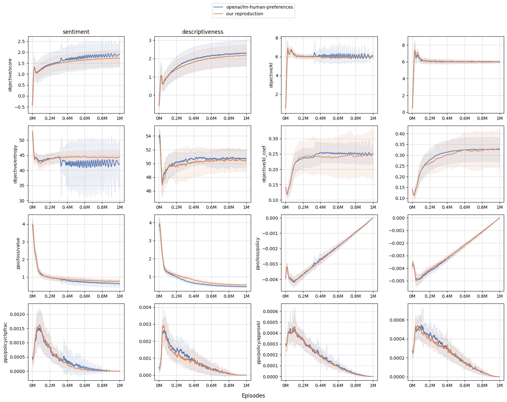

# lm-human-preference-details

This repo aims to make a blog post similar to [*The 37 Implementation Details of Proximal Policy Optimization*](https://iclr-blog-track.github.io/2022/03/25/ppo-implementation-details/) but for RLHF techniques used in https://github.com/openai/lm-human-preferences.


The goal of the repo is 1) to provide a simple-to-read and minimal reference implementation of RLHF and 2) to create rigorous benchmarks and to match the learning curves of `openai/lm-human-preferences`.

This repo is just for educational / learning purposes. For more advanced users, https://github.com/lvwerra/trl would be a great choice.

## Get started

```
poetry install
poetry shell
accelerate launch \
    --num_processes 8 \
    lm_human_preference_details/train_both_accelerate.py \
    --reward.track --policy.track
accelerate launch \
    --num_processes 8 \
    lm_human_preference_details/train_both_accelerate.py \
    --reward.track \
    --reward.label_dataset=descriptiveness/offline_5k.json \
    --policy.track
```

You can also run stuff individually. For example, to train the reward model, run
```
accelerate launch \
    --num_processes 8 \
    lm_human_preference_details/train_reward_accelerate.py \
    --track
```

to train the policy model, run
```
accelerate launch \
    --num_processes 8 \
    lm_human_preference_details/train_policy_accelerate.py \
    --track
```


> ⚠️ **NOTE**: You can install the latest torch or jax with the following command:
```
poetry run pip install torch==2.0.1
poetry run pip install "jax[cuda11_cudnn82]==0.4.8" -f https://storage.googleapis.com/jax-releases/jax_cuda_releases.html
poetry run pip install git+https://github.com/huggingface/huggingface_hub@main
```

## Current status

Currently, for reproduction, I used the same dataset, data processing pipeline, hyperparameters, and initial model architecture and weights (`gpt2` 124M pretrained model). The following chart shows our reproduction can match the learning curves of `openai/lm-human-preferences`.



